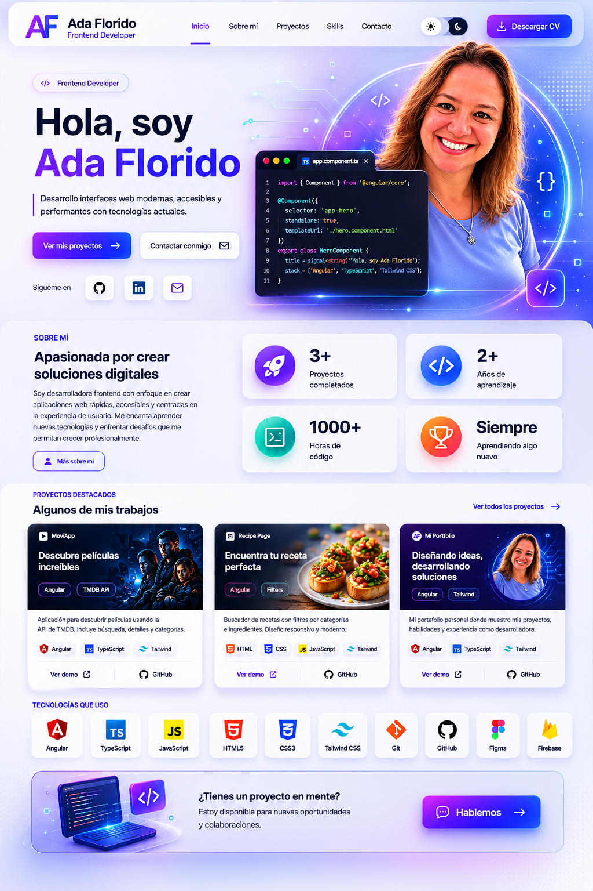

# 💼 Ada Florido Portfolio

Portafolio personal desarrollado con Angular y Tailwind CSS para mostrar mis proyectos, habilidades y experiencia como Frontend Developer.

## 🚀 Tecnologías utilizadas

- Angular
- TypeScript
- Tailwind CSS
- HTML5
- CSS3
- Firebase Hosting

## ✨ Características

- Diseño moderno y responsive
- Interfaz tecnológica y elegante
- Sección de proyectos destacados
- Presentación de habilidades técnicas
- Animaciones y efectos visuales
- Optimizado para desktop y mobile

## 📂 Proyectos destacados

- 🎬 MoviApp
- 🍳 Recipe Page
- 💼 Portfolio Personal

## 🌐 Deploy

Publicado con Firebase Hosting.


# 🚀 Instalación

Clona el repositorio:

```bash
git clone https://github.com/aflorido266/portafolio-adaflorido.git

---

# 📸 Preview



---

src/
│
├── app/
│   ├── feature/
│   │   ├── hero/
│   │   ├── navbar/
│   │   └── contact/
│
├── assets/
│   └── images/
│
├── styles.css
│
└── main.ts

🎨 Diseño

El diseño del portfolio está inspirado en interfaces modernas de desarrollo frontend con:

Gradientes suaves
Glassmorphism
Glow effects
Fondos tecnológicos
Tarjetas flotantes
Estética developer moderna

📬 Contacto
💼 LinkedIn: https://linkedin.com/in/TU-LINK
💻 GitHub: https://github.com/TU-USUARIO
📧 Email: tuemail@email.com

🌟 Autor

Desarrollado por Ada Florido ✨

Frontend Developer apasionada por crear interfaces modernas, accesibles y responsivas.